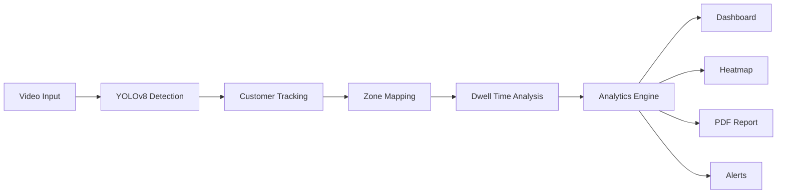

# 🛒 RetailVision – AI-Based Customer Behavior Analytics

<p align="center">


\

</p>

---

# 📌 Overview

**RetailVision** is an AI-powered customer behavior analytics system that automates retail store monitoring using **Computer Vision** and **Artificial Intelligence**. By processing CCTV footage or live camera streams, the system detects and tracks customers in real time, analyzes shopping behavior, generates traffic heatmaps, monitors queue congestion, and provides actionable business insights.

RetailVision eliminates the need for manual observation by transforming raw video data into meaningful analytics that help retailers optimize store layouts, improve customer experiences, and increase sales.

This project is ideal for **final-year engineering projects**, **Smart India Hackathon**, **AI research**, and **retail business intelligence applications**.

---

# 🎯 Project Objectives

Traditional retail stores often struggle to understand customer movement patterns, shelf engagement, and billing queue congestion without expensive manual analysis.

RetailVision addresses these challenges by:

* Detecting and tracking customers using AI.
* Monitoring customer movement across different store zones.
* Measuring dwell time near shelves.
* Generating visual customer traffic heatmaps.
* Detecting billing queue congestion.
* Providing real-time alerts for crowd management.
* Displaying analytics through an interactive dashboard.
* Generating business reports for store optimization.

---

# 🏗 System Architecture

```text
                   CCTV Camera / Webcam
                           │
                           ▼
                  Video Frame Capture
                           │
                           ▼
              YOLOv8 Person Detection Model
                           │
                           ▼
                  Multi-Object Tracking
                           │
           ┌───────────────┼───────────────┐
           ▼               ▼               ▼
      Zone Tracking    Dwell Time      Queue Analysis
           │               │               │
           └───────────────┼───────────────┘
                           ▼
                  Analytics Engine
                           │
         ┌─────────────────┼─────────────────┐
         ▼                 ▼                 ▼
    Heatmap          Dashboard         PDF Reports
```

---

# ⚙ System Workflow



---

# 🚀 Features

* AI-powered customer detection
* Real-time customer tracking
* Unique customer ID assignment
* Zone-wise movement analysis
* Shelf dwell time calculation
* Customer traffic heatmaps
* Billing queue monitoring
* Crowd density analysis
* Interactive analytics dashboard
* Business report generation
* Historical analytics
* Live CCTV/Webcam support

---

# 📊 Core Analytics

## 👤 Customer Detection & Tracking

Each detected customer receives a unique tracking ID that is maintained throughout the shopping session.

---

## 📍 Zone Tracking

RetailVision continuously records each customer's **(X, Y)** coordinates and maps them to predefined store zones.

Example zones include:

* Entrance
* Vegetables
* Grocery
* Snacks
* Beverages
* Billing Counter
* Exit

---

## ⏱ Dwell Time Analytics

The system calculates how long customers remain in each zone.

Benefits include:

* Product interest analysis
* Shelf engagement measurement
* Customer behavior understanding

---

## 🔥 Heatmap Generation

Customer movement history is accumulated to generate traffic heatmaps.

Heatmap Colors:

* 🔴 Red → High Traffic
* 🟠 Orange → Medium Traffic
* 🔵 Blue → Low Traffic

Heatmaps help retailers optimize store layouts and product placement.

---

## 🚨 Real-Time Alerts

RetailVision automatically generates alerts for important events.

### Shelf Interest Alert

Triggered when a customer stays near a shelf for more than:

```text
20 Seconds
```

---

### Billing Queue Alert

Triggered when the billing queue exceeds:

```text
10 Customers
```

---

### Crowd Alert

Triggered when store occupancy exceeds:

```text
30 Customers
```

---

# 📊 Dashboard

The dashboard provides real-time business insights including:

* Live Customer Count
* Active Tracking IDs
* Zone-wise Visitors
* Heatmap Visualization
* Shelf Dwell Time
* Queue Statistics
* Alert Notifications
* Hourly Customer Trends
* Store Occupancy
* Historical Analytics

---

# 🛠 Technology Stack

| Module               | Technology           |
| -------------------- | -------------------- |
| Programming Language | Python 3.11+         |
| AI Detection         | YOLOv8 (Ultralytics) |
| Object Tracking      | ByteTrack            |
| Computer Vision      | OpenCV               |
| Numerical Processing | NumPy                |
| Visualization        | Matplotlib           |
| Backend              | Flask                |
| Database             | SQLite               |
| Frontend             | HTML5                |
| Styling              | CSS3 + Bootstrap 5   |
| Dashboard Charts     | Chart.js             |
| PDF Reports          | FPDF2                |

---

# 📂 Project Structure

```text
RetailVision/

├── dataset/             # Optional custom YOLO datasets
├── models/              # YOLOv8 model weights
├── videos/              # Sample videos
├── outputs/             # Processed videos
├── heatmaps/            # Generated heatmaps
├── reports/             # PDF reports
├── static/
│   ├── css/
│   │   └── style.css
│   ├── js/
│   │   └── dashboard.js
│   └── heatmap.png
├── templates/
│   ├── index.html
│   └── dashboard.html
├── app.py
├── database.py
├── tracker.py
├── detect.py
├── heatmap.py
├── analytics.py
├── report.py
├── requirements.txt
└── README.md
```

---

# 🚀 Installation & Setup Guide

## 1. Clone or Extract the Project

Extract the project into your preferred workspace.

---

## 2. Install Dependencies

```bash
pip install -r requirements.txt
```

---

## 3. Initialize the Database

```bash
python database.py
python analytics.py
```

This creates the SQLite database, user accounts, and inserts sample analytics data for demonstration.

---

## 4. Generate Initial Assets

```bash
python heatmap.py
python report.py
```

---

## 5. Launch the Application

```bash
python app.py
```

Open your browser and navigate to:

```text
http://127.0.0.1:5000
```

---

# 🔐 Default Login Credentials

### Store Administrator

Full access to the system.

```text
Username : admin
Password : admin123
```

---

### Store Manager

Read-only dashboard access.

```text
Username : manager
Password : manager123
```

---

# 📹 Video Input Options

RetailVision supports two input modes.

### Store Simulation

* Synthetic customer simulation
* No camera required
* Ideal for project demonstrations

---

### Webcam / USB Camera

Uses YOLOv8 to detect and track customers in real time.

---

## Command-Line Detection

Run customer tracking on a recorded video.

```bash
python detect.py --source "videos/store_footage.mp4" --yolo --output "outputs/output_result.mp4"
```

For webcam input:

```bash
python detect.py --source 0 --yolo
```

---

# 📈 Analytics Algorithms

## Dwell Time Calculation

The system records customer entry and exit timestamps for each zone and calculates total time spent.

---

## Shelf Interest Detection

Customers remaining near products for more than **20 seconds** trigger product engagement alerts.

---

## Queue Monitoring

The billing area is continuously monitored.

Alert threshold:

```text
10 Customers
```

---

## Crowd Monitoring

The system tracks total active customers.

Alert threshold:

```text
30 Customers
```

---

# 📈 Performance

| Metric                | Value      |
| --------------------- | ---------- |
| Customer Detection    | Real-Time  |
| Multi-Object Tracking | Supported  |
| Heatmap Generation    | Live       |
| Queue Monitoring      | Yes        |
| Dashboard             | Real-Time  |
| Reports               | PDF Export |

---

# 💡 Future Enhancements

* Face Recognition Integration
* Product Recommendation Analytics
* Emotion Detection
* Customer Demographics
* Multi-Camera Support
* Cloud Database Integration
* Mobile Dashboard
* AI Sales Prediction
* Customer Path Prediction
* Deep Learning-Based Customer Behavior Analysis

---

# 📷 Screenshots

Add screenshots inside:

```text
screenshots/
```

Example:

```text
screenshots/dashboard.png
screenshots/heatmap.png
screenshots/tracking.png
screenshots/alerts.png
```

Display them in the README using Markdown image tags.

---

# 📚 Conclusion

RetailVision demonstrates how Artificial Intelligence and Computer Vision can transform retail analytics by automatically detecting customers, tracking movement, analyzing shopping behavior, generating heatmaps, monitoring queues, and producing valuable business insights.

By combining **YOLOv8**, **ByteTrack**, **OpenCV**, **Flask**, and **interactive dashboards**, RetailVision provides an efficient, scalable, and intelligent solution for modern retail stores.

---

# 👨‍💻 Author

**Rithikan T**

**Computer and Communication Engineering**

Artificial Intelligence • Computer Vision • Python • Flask

---

# 📄 License

This project is licensed under the **MIT License**.

---

# ⭐ Support

If you found this project useful:

⭐ Star this repository

🍴 Fork this repository

🐞 Report Issues

🚀 Contribute to improve the project
